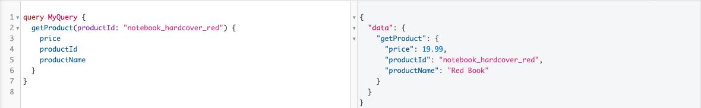
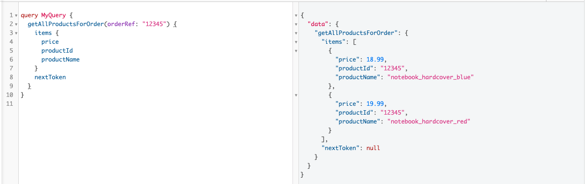
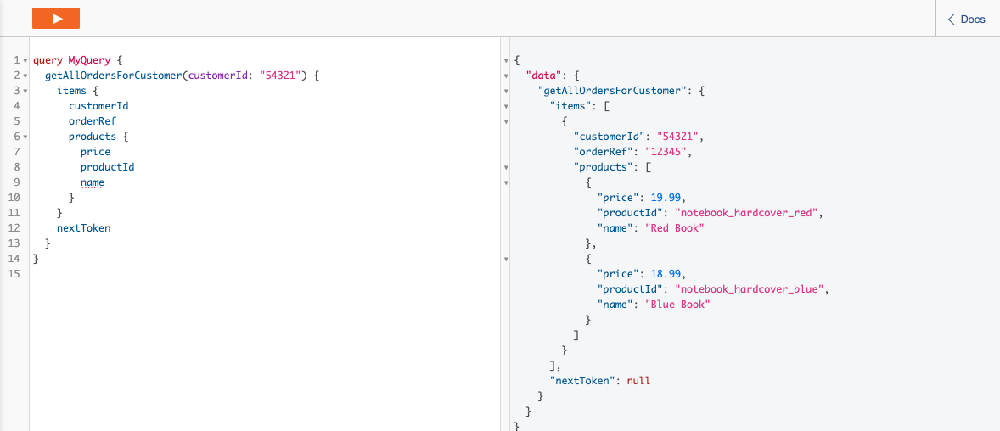
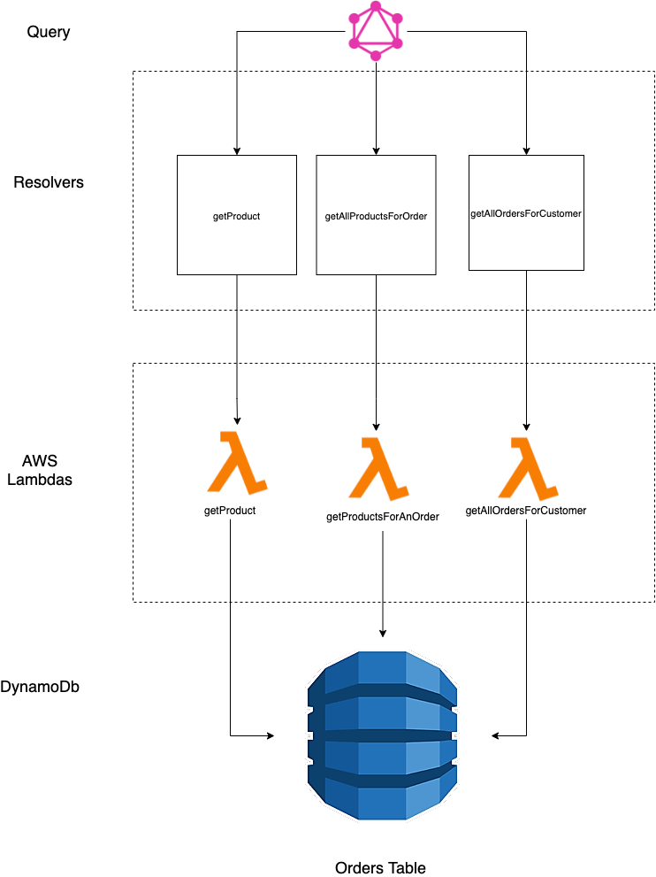

# Solution

For the given data set on the problem. I have assumed the following:

- Each customer has one to many orders.
- Each order has one to many products.

In order to achieve the following api requests listed below. I have decided to use aws lambda(serverless) with GraphQl. Using typescript and NodeJS for the lambda code. I have decided to use DynamoDb(no sql) as the database to store the data.I have decided to use CDK to deploy the infrastructure.

- Getting a product using the productId.
- Getting all the items/products for an order using the `orderRef`.
- Getting all the orders for a customer using the `customerId`.

## DynamoDb

- I wanted to use a single table design with the hashKey as the `id` column and the rangeKey as the `sortKey` column.
- The reason behind using NoSql rather than SQL was that SQL will needed to have the following  3 tables in order to achieve relational database structure as shown below. This will require joining table when fetching for all the orders for a customer or all the items in an order.
- With a single table structure, even tough you will have lots of data redundancy, it will have more efficient look up as you would be avoiding lots of joins making the api more scalable and efficient as the size of data increases. The SQL joins are expensive and requires scanning large portion of multiple tables in the relational database. As the data gets larger, this will become less efficient.

### Potential SQL Table Design:
### Customers Table

| CustomerId (PK) | OrderRef (FK) |
| --------------- | ------------- |
| 54321           | 12345         |

### Orders Table

| OrderId (PK) | ProductId (FK)          |
| ------------ | ----------------------- |
| 12345        | notebook_hardcover_red  |
| 12345        | notebook_hardcover_blue |

### Products Table

| ProductId (PK) | name          | price |
| -------------- | ------------- | ----- |
| 12345          | Red Notebook  | 19.99 |
| 12345          | Blue Notebook | 18.99 |

###  DynamoDb Table Design
- The expected table structure:
  | id | sortKey | products | name | price |
  |-------------------------|-------------------------|------------------------------------------------------------------------------------------------------------------------------------------------------------------------------------------------------------------|-----------|-------|
  | 54321 | 12345 | [{ "name": "Red Book", "price": 19.99, "productId": "notebook_hardcover_red" }, { "name": "Blue Book", "price": 18.99, "productId": "notebook_hardcover_blue" }] | | |
  | 12345 | notebook_hardcover_red | | Red Book | 19.99 |
  | 12345 | notebook_hardcover_blue | | Blue Book | 18.99 |
  | notebook_hardcover_red | Red Book | | | 19.99 |
  | notebook_hardcover_blue | Blue Book | | | 18.99 |

  
  - The first row on the table will allow the user to get all the customers orders. The id here represents the customerId and the sortKey represent the orderRef.

  - The second and the third rows on the table are the orders placed. Here the id represents orderRef and the sortKey represents the productId.

  - The forth and the fifth row represents the products, id being the productId and the sortKey being the name of the product.

## Lambdas

- I have opted in for using AWS Lambda's as it easier to scale for parallel requests.
- There are three lambdas:
  - `getProducts` lambda will query the `orders` table to get the specific product for the given productId.
  - `getProductsForAnOrder` lambda will query the `orders` table to get all the items for a given orderRef. As there is one to many items in an order. You will be able to paginate the results and also will be able to limit how many items to retrieve on each page.
  - `getCustomersOrders` will query the `orders` table to get all the orders for a given `customerId`. As a customer can have multiple orders, we can paginate the results and also will be able to limit how many items to retrieve on each page.

## GraphQl

Below is my GraphQL schema:

```
type Order {
	customerId: String!
	orderRef: String!
	products: [Product!]!
}

type OrderConnection {
	nextToken: String
	items: [Order!]!
}

type Product {
	price: Int!
	name: String!
	productId: String!
}

type ProductConnection {
	nextToken: String
	items: [Product!]!
}

type Query {
	getProduct(productId: String!): Product!
	
  getAllProductsForOrder(orderRef: String!, limit: Int, nextToken: String): ProductConnection!
	
  getAllOrdersForCustomer(customerId: String!): OrderConnection!
}
```

- There will 3 resolvers attached onto this schema that will trigger one of the lambdas described above.
  - There will be a resolver attached to the Query field of `getProduct` which will invoke the `getProduct` lambda.
  - There will be a resolver attached to the Query field of `getAllProductsForOrder` which will invoke the `getProductsForAnOrder` lambda.
  - There will be a resolver attached to the Query field of `getAllOrdersForCustomer` which will invoke the `getCustomersOrders` lambda.

* Both of the `getAllProductsForOrder` and `getAllOrdersForCustomer` takes in the optional parameters of nextToken and limit which is used for pagination. Returns a connection object where nextToken and array of items is returned. If nextToken applicable then next page can retrieved.

### Execution of queries on AWS AppSync

#### Get Product Query



#### Get Products for given OrderRef Query



#### Get Orders for given CustomerId Query



### System Diagram



# Project

- The project included in the repo represent the explained solution.
- The code is written in TypeScript.
- It consist the src directory which has the:
  - Lambda code
  - DynamoDb code
  - Types
- It also has the deploy directory
  - This has the AWS infrastructure code using the `CDK` which will deploy the Graphql,DynamoDb and the 3 lambdas to AWS code.
- In order to run the project you will need to do `npm run build`. This will create a zip file in `dist` directory which will be used late to deploy the lambda code.
- Once run this step, you can execute `npm run deploy` to deploy the infrastructure to AWS.(You will need AWS cli installed and setup your credentials).
