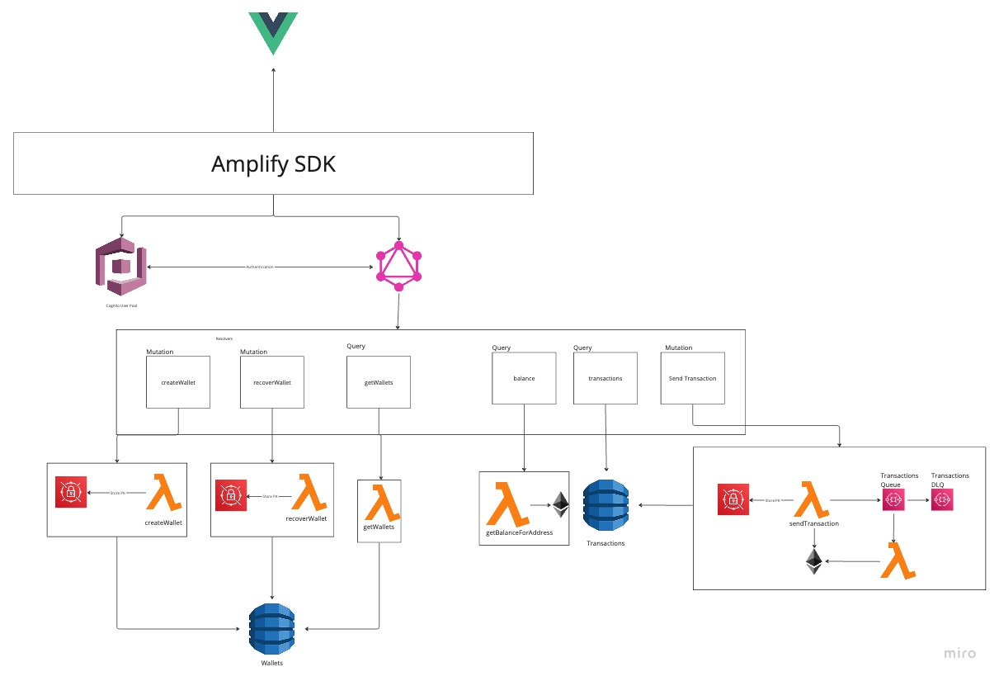

# Project
-  Overall aim of the project is to build a cross chain blockchain wallet and safeguard the private keys removing the need to remember seed phrases or store your private key. This POC at the moment and keys are currently are stored in secrets manager which is not the safest thing to do. Later on, we will be looking into sharding and signing with UBI keys.
- Currently the project creates an ethereum based wallets under an HD Wallet that you can see your balances, transactions, send and receive transactions. Currently only Ethereum is supported. There is no erc20 token support but this will be added in the future.You can see your erc20tokens balances tough. This all accessible trough the graphql api.
- There is a different [repo](https://github.com/nejati92/wallet-port) for building the front end in VUE.js
- Below is the architecture diagram of the system:

## TODOS
- TESTS
- CONFIG PARSER
- Validation params
- Improve error handling and have types (ie failed validation)
- Encrypt secrets manager 
- Consider using SQL for transactions and look into building resolvers to get data out of RDS.
- MOVE VTL templates out of deploy code to a file
- No Pagination on transactions
- Nonce queueing ( currently one tx at a time)
- Transaction monitor uses the queue retry to see if it is accepted by the blockchain,after 5 retries moves it to DLQ.This is not a great design because transaction mining can take longer then 5 retries. Think of increasing the retries and wait time in between or use cron lambdas.
- Async transaction sending
- Key sharding
- Use an own indexer rather than 3rd party api

# Code Structure
- The code is written in TypeScript.
- It consist the src directory which has the:
  - Lambda code
  - DynamoDb code
  - Types
- It also has the deploy directory
  - This has the AWS infrastructure code using the `CDK` which will deploy the Graphql,DynamoDb and the 3 lambdas to AWS code.
- In order to run the project you will need to do `npm run build`. This will create a zip file in `dist` directory which will be used late to deploy the lambda code.
- Once run this step, you can execute `npm run deploy` to deploy the infrastructure to AWS.(You will need AWS cli installed and setup your credentials).

- In order  to deploy you will need to have an AWS account with your AWS credentials set up as well as Alchemy is used to contact to the ethereum blockchain.
`
export ACCOUNT_ID=""
export ALCHEMY_API_KEY=""
export REGION=""
`

